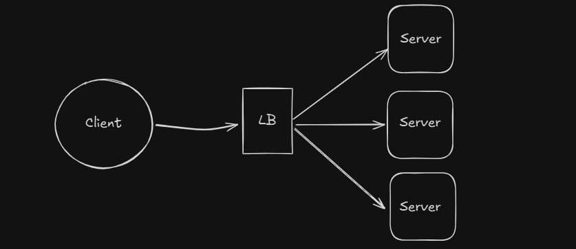

# Go Load Balancer

A simple yet functional HTTP load balancer implemented in Go as a learning exercise. This project was created to explore and understand various Go concepts while building something practical.

## Key Features

- **Round-Robin Load Balancing**: Simple but effective distribution of requests
- **Health Checks**: Automatic detection and bypass of unhealthy servers
- **API Key Authentication**: Basic security layer for protected endpoints
- **Dynamic Server Management**: Support for multiple backend servers



## Project Structure

```
├── cmd/gateway      # Application entrypoint
└── pkg/            # Public packages
    ├── loadbalancer
    ├── middleware  
    └── server     
```

## Quick Start

1. Start the server:
```bash
go run ./cmd/gateway
```

2. Run tests:
```bash
./test.ps1  # End-to-end tests
```

## Learning Outcomes

This project provided practical experience with:
- Go's concurrency patterns (goroutines, WaitGroups)
- HTTP handling and reverse proxying
- Middleware implementation
- Project structure and organization

## Note

This is a learning project and while functional, it's not intended for production use. It was built to understand Go's features and patterns in a practical context.
